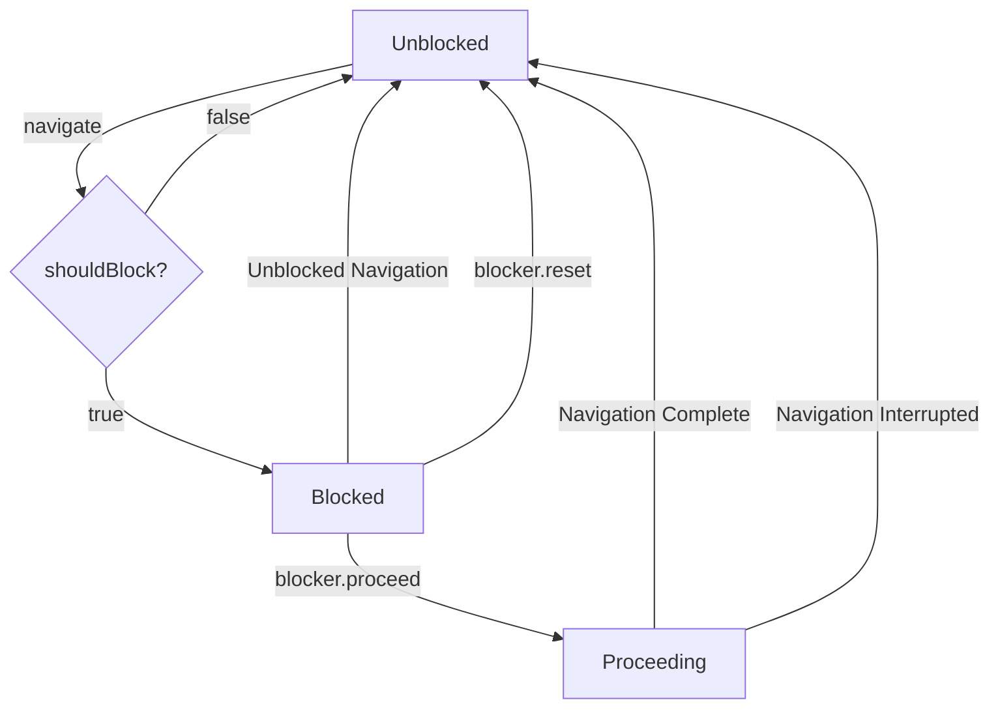

# useBlocker

Date: 2023-01-17

Status: accepted

## Context

React Router v5 had a [`<Prompt>`](https://v5.reactrouter.com/core/api/Prompt) component that allowed app developers to indicate when navigation should be blocked (via the `when` prop), and specify a string message to display in a `window.confirm` UI that would let the user confirm the navigation. The _primary_ use case for this is preventing users from losing half-filled form info when navigating away.

The React Router v6 beta initially had two hooks to replace this component (`useBlocker` and `usePrompt`) but they were [removed](https://github.com/remix-run/react-router/issues/8139#issuecomment-954425560) during the beta release process. The reasoning being:

> As for why it was removed in v6, we decided we'd rather ship with what we have than take even more time to nail down a feature that isn't fully baked.

Folks then started [adding](https://github.com/remix-run/react-router/issues/8139#issuecomment-977790637) this functionality back in manually using `navigator.block` via the `UNSAFE_NavigationContext` so they could upgrade their apps from v5 to v6 while keeping the blocking ability.

However, as part of the 6.4 data-routing work, we significantly streamlined and inlined the `history` library and [removed the `block` method](https://github.com/remix-run/react-router/issues/8139#issuecomment-1176523524), causing issues for those using the `UNSAFE_NavigationContext` workaround. Although, there was still ways to achieve this [via an `unstable_HistoryRouter`](https://github.com/remix-run/react-router/issues/8139#issuecomment-1247080906).

In September we [commented](https://github.com/remix-run/react-router/issues/8139#issuecomment-1262630360) back further advising our stance that storing data in `localStorage` was a preferable pattern to blocking.

Over time though, we did receive some valuable feedback which indicated some other use cases where blocking was useful, and stashing form info in localStorage might not be sufficient:

- [Cancelling long-running processes](https://github.com/remix-run/react-router/issues/8139#issuecomment-970770513)
- [Waiting for an API call to finish](https://github.com/remix-run/react-router/issues/8139#issuecomment-1272052155)
- [Waiting for a file upload to complete](https://github.com/remix-run/react-router/issues/8139#issuecomment-1293247842)
- [Navigating away might very well be an indication that they want to clear the form data](https://github.com/remix-run/react-router/issues/8139#issuecomment-1285824941)
- [Sensitive form info which cannot be put in `localStorage`](https://github.com/remix-run/react-router/issues/8139#issuecomment-1294245742)

Based on the feedback, we [decided to re-consider](https://github.com/remix-run/react-router/issues/8139#issuecomment-1302775114) but [with known limitations](https://github.com/remix-run/react-router/issues/8139#issuecomment-1302822885) so that we weren't preventing users from benefitting from the awesome new features in 6.4 and beyond.

### Why is this so hard?

Having not used React Router v5, nor it's blocking functionality, I can only guess at what I _think_ the main pain points were. Then we can look at how we might solve then in a v6 implementation.

Blocking `PUSH`/`REPLACE` navigations is generally straightforward - they come through `history` so we can deal with blockers _before_ we call `window.history.pushState`, and if blocked skip the call all together. This means the URL and the UI remain synced.

Blocking `POP` navigations is different - since we don't know about them via `popstate` until _after_ the URL has been updated - so we're immediately in an unsynced state. I.e., if we've navigated `A -> B -> C` and the user hits the back button - we evaluate our blockers while the UI shows `C`, but the url shows `B`. However, v5 had a way to handle that as well - by storing an `index` on the `location.state` we can determine what the `popstate` delta was and [revert it](https://github.com/remix-run/history/blob/dev/packages/history/index.ts#L398) if the navigation was blocked.

So what was the issue? I _think_ it boiled down not to _how to block_ but instead in _when to retry_. We exposed a `retry` function to userland as part of `useBlocker` and therefore we lost control over _when_ that function might be called. A retry of a blocked `POP` navigation is _inherently tightly-coupled to the current location oin the history stack_. But by exposing `retry`, we could no longer ensure that `retry` was called from the right location. For example:

1. User is sitting on `C`, with a history stack of `A -> B -> C`
2. User clicks back to `B`, and the navigation is blocked.
3. We reset history to `C` and provide a retry of `() => pop(-1)`
4. User clicks back to `B` and then `retry` gets called, we land on `A`, not the `B` the original blocked transition intended to take us to

Specifically, part of the issue comes down to the fact that while `window.confirm` is synchronous on the JS thread, is does not prevent additional user interaction with the back/forward buttons. This causes issues with `retry` like the flow described above.

1. User is sitting on `C`, with a history stack of `A -> B -> C`
2. User clicks back to `B`, and we show the `window.confirm` prompt
3. _Before answering,_ the user clicks the back button again (at this point the browser is at `B`, so this back button goes to `A`)
4. In Chrome, this causes `window.confirm` to return `false` (indicating we should block the C->B back button click) but it respects the new back button click!
5. So now the user is sitting on `A`, but our history library thinks we're on `C` since it thinks we blocked the original back button navigation

It's also worth noting that these `popstate` blockers don't work on navigations leaving your app - such as cross-origin or full document reloads. To handle those, you need to also wire up a `beforeunload` event listener on `window`. This _does_ block further back-button clicks while it's open so it's not subject to the same issues as `window.confirm` above.

### How can we tackle this in a limited v6 implementation?

Having played around with some of our POC implementations in v6, I think we've identified a few assumptions we will need to make oin order to implement blocking in a reliable way.

1. The answer to _"should I block this navigation"_ must be instantaneous/synchronous. there must be no way for the user to perform any _additional_ navigations while answering this question.
   1. If this is always instantaneous, it allows us to decide immediately on a `popstate` whether we even need to revert. In v5, we would automatically revert, then run the blocker, then maybe retry the navigation. In v6, non-blocked navigations are a no-op, and blocked navigations are immediately reverted which re-syncs the with the URL _before any other navigations can happen_.
   2. This assumption therefore excludes the potential for `usePrompt` because while the `window.confirm` function is synchronous, it does not block additional user-initiated navigations. Furthermore, browser behave [very differently](https://github.com/remix-run/react-router/pull/9709#discussion_r1060171714) when it comes to back button clicks while a `window.confirm` prompt is open. Any attempt to support `window.confirm` in React Router will inevitable result in a table in our docs explaining [why and how](https://github.com/remix-run/react-router/pull/9821) each browser behaves differently. This is a non-starter from a UX perspective in my eyes.
2. Blockers can not persist across navigations
   1. As soon as a successful navigation is completed, we must reset all blockers since their `retry` functions are inherently stale and therefore calling them can only do more weird things.
3. There can only be one blocker present at a time
   1. When Chance and I initially talked through this we had thoughts on how we could maybe support multiple blockers. The use-cases are not immediately obvious, but likely a case when a page has multiple separate forms each of which could be in a valid or half-filled state. This makes the logic potentially very confusing if some block and others don't, and by the time one is cleaned up the other blocks and so on.
   2. Thankfully, it turns out [this limitation existed in v5](https://github.com/remix-run/history/blob/v4/modules/createTransitionManager.js#L7) as well - so I think we should carry this forward. If, once we add this back to v6 we find compelling use-cases, maybe we can investigate multiple-blocker support in the future.

With these assumptions in mind, I think we can implement a fairly robust `useBlocker` hook in v that would suffice for the majority (if not all) known use-cases, and we could clearly document where this hook has rough edges. Any usage of `window.confirm` would be left to a userland implementation of `usePrompt` and all of the concerns that come with it are then part of the application and not React Router.

### What are the use-cases, exactly?

As part of the ongoing Github Discussion, [Chance asked](https://github.com/remix-run/react-router/issues/8139#issuecomment-1332652167) folks if they could elaborate on how they were using the `<Prompt>` component in v5 and specifically if they were using the `getUserConfirmation` prop to customize the experience away from `window.confirm`. As it turns out,. it seems the vast majority of folks were opting _not_ to use `window.confirm`- either via getUserConfirmation or more often via a bit of a hacked implementation of `<Prompt message={() => { ... }} />`.

- Some folks used `getUserConfirmation` to avoid `window.confirm`
  - _In order to be consistent with the rest of our UI (notably with other similar but not router-related confirmation dialogs), we don't rely on the native window.confirm(), we use material-ui confirmations modals._ [link](https://github.com/remix-run/react-router/issues/8139#issuecomment-1337538869)
  - _We use getUserConfirmation however we instead default to true and show a toast message._ [link](https://github.com/remix-run/react-router/issues/8139#issuecomment-1337670812)
- Other folks built custom UI via manual `history.block` usage
  - _Never happened to need getUserConfirmation prop. When customization was needed we used history.block to build custom prompt around it._ [link](https://github.com/remix-run/react-router/issues/8139#issuecomment-1336392940)
- Other folks used the `message` prop function to trigger custom modals
  - _For us, while window.confirm is convenient as a default, custom modal dialog is what the designers/product people want, so we want to be able to provide a react component (either with state like this, or a render prop)._ [link](https://github.com/remix-run/react-router/issues/8139#issuecomment-1337053026)
  - _we don't use getUserConfirmation, but instead rely on the boolean return option from Prompt.message, specifically the ability to return false to block without a message._ [link](https://github.com/remix-run/react-router/issues/8139#issuecomment-1337707665)
  - _Our use-case is to use <Prompt> to show a Warning-Confirm-Modal when the User has changed stuff in the Configuration in the state, but has not submitted it._ [link](https://github.com/remix-run/react-router/issues/8139#issuecomment-1339033495)
  - _we are only using the <Prompt> component (didn't need getUserConfirmation) to show a [custom] confirm dialog if the user tries to change location with an unsaved form._ [link](https://github.com/remix-run/react-router/issues/8139#issuecomment-1340647770)
  - _We mostly use usePrompt and we hope the new version can still provide flexibility to utilize the window.prompt as well custom modal scenarios._ [link](https://github.com/remix-run/react-router/issues/8139#issuecomment-1343441620)

In the end, there are maybe 1-2 folks who responded that use the simple `window.confirm` scenario, and instead _almost all_ people are skipping `window.confirm` in favor of a custom dialog. I don't find this very surprising - knowing the look I'd have gotten from prior UX designers if I said that wa the UI were going to ship to our users 😉.

#### (Ab)use-cases

Some folks have mentioned that they don't it to block navigation, but instead to detect _before_ a navigation happens for firing off analytics or what not. While `useBlocker` could be abused for this purpose, that will eventually be solved more accurately via the proposed [Events API](https://github.com/remix-run/react-router/discussions/9565)

## Decision

The proposal for support in v6 is to implement a single low-level `useBlocker` hook that provides the user enough information to (1) show a custom confirmation alert/dialog/modal/etc. and (2) allow the navigation to proceed if the user accepts the dialog. This would only allow one active blocker at a time in the component tree, and would error or warn if a second `useBlocker` was encountered.

```tsx
type Blocker =
  | {
      state: "unblocked";
      reset: undefined;
      proceed: undefined;
    }
  | {
      state: "blocked";
      reset(): void;
      proceed(): void;
    }
  | {
      state: "proceeding";
      reset: undefined;
      proceed: undefined;
    };

declare function useBlocker(shouldBlock: boolean | () => boolean): Blocker;

function MyFormComponent() {
  let [formIsDirty, setFormIsDirty] = React.useState(false);
  let blocker = useBlocker(formIsDirty);

  return (
    <Form method="post" onChange={(e) => setFormIsDirty(true)}>
      <label>
        First name:
        <input name="firstname" required />
      </label>
      <label>
        Last name:
        <input name="lastname" required />
      </label>
      <button type="submit">Submit</button>

      {blocker.state === "blocked" ? (
        <div>
          <p>You have unsaved changes!<p>
          <button onClick={() => blocker.reset()}>
            Oh shoot - I need them keep me here!
          </button>
          <button onClick={() => blocker.proceed()}>
            I know! They don't matter - let me out of here!
          </button>
        </div>
      ) : blocker.state === "proceeding" ? (
        <p>Navigating away with unsaved changes...</p>
      ) : null}
    </Form>
  );
}
```

The `blocker` received by the user would be either `unblocked`, `blocked`, or `proceeding`:

- `unblocked` is the normal idle state
- `blocked` means the user tried to navigate and the blocker function returned `true` and the navigation was blocked. When in a `blocked` state the blocker would expose `proceed`/`reset` functions:
  - `blocker.proceed()` would allow the blocked navigation to happen (and thus lose unsaved changes). This proceed navigation would _not_ re-run the blocker function.
  - `blocker.reset()` would reset the blocker back to `unblocked` and remain on the current page
- `proceeding` indicates the navigation from `blocker.proceed()` is in-progress - and essentially reflects the non-`idle` `navigation.state` during that navigation

Other navigations and/or interruptions to proceeding navigations would reset the blocker back to an unblocked state.

~We will not provide a `usePrompt` implementation, however it would be somewhat trivial to implement that on top of `useBlocker` in userland.~

We decided in the end to include a `usePrompt` even though it's got more broken edge cases than `useBlocker`:

- It's only a handful of lines of code
- It's more similar to what we had in v5
- We don't know for sure how many folks were using this in v5, since the github commenters are not a complete sample
- It has a lower barrier to implement than a custom modal UI
- We plan to document that it breaks in more cases, in weird ways, and even differently across browsers.

### Blocker State Diagram



### Open Questions

- Initial implementation is for data-router usage (6.4+). We still need to back-port to 6.3 and earlier to help folks migrate from `v5 -> v6 BrowserRouter -> v6 RouterProvider`
  - We decided that this can just be net-new 6.4+ API. A v5 app should be able to migrate to a 6.4+ `RouterProvider` just as easily as a 6.3 `BrowserRouter`
- We should probably pass the `historyAction`/`location` of the active navigation to `shouldBlock()` similar to how v5 did it. Should we also pass the submission (`formMethod`, `formData`, etc.)?
  - For now we landed on calling the blocker function with `{ currentLocation, nextLocation, historyAction }` to align naming loosely with `shouldRevalidate`. Can always extend that API ion the future if needed (with form submission info).
- I think since we are not providing `usePrompt`, we should accept a `beforeUnload:boolean` option to add cross-navigation handling in an opt-in fashion.
  - `beforeUnload` is also unreliable because it does not prevent the user from doing additional back/forward navigations ao this is not included out of the box and can be implemented in user-land.
