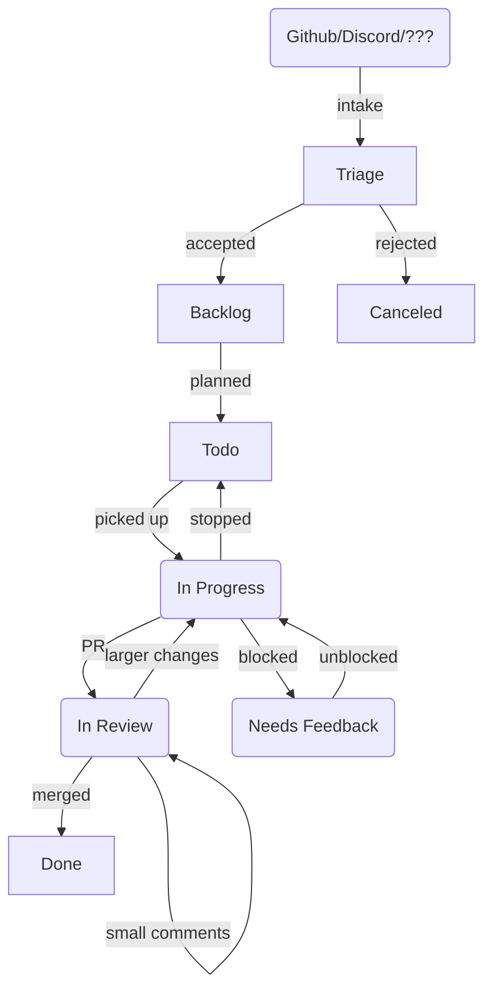

# Linear Workflow

Date: 2022-09-06

Status: accepted

## Context

The Remix development team uses Linear internally to manage and prioritize ongoing development of Remix and React-Router. In order to keep this process flowing smoothly, we document here the set of established workflows within Linear, so developers have a documented process to refer to if questions should arise.

## Linear Terms

This document will use many of the following Linear terms:

- **Issue** - A ticket/task in the Linear system that describes a unit of work to be completed
- **Cycle** - A group of issues aimed to be completed within a given 1-week period (similar to a "sprint" in other Agile workflows)
- **Project** - A group of issues that comprise a larger scope of work (for example, a new feature)
  - Projects will almost always span multiple Cycles.
- **Status** - The state of a given Issue (Todo, In Progress, Done, etc.)
- **Assignee** - The person the Issue is currently assigned to - this indicates who is expected to take the next action to move the Issue forward
- **Label** - Linear Issues can be assigned one or more Labels for filtering/searching

## Decision

### Status Definitions

The Linear workflow is governed by the **Status** field, which has the following options:

- **Triage** - Issue is not yet reviewed and we have no idea if we'll actually do this work
- **Backlog** - Issue has been accepted as something we would like to do, but is not currently planned
- **Todo** - Issue has been planned for a given Cycle of work
- **In Progress** - Issue is actively being worked on in the active Cycle
- **In Review** - Issue is completed and in a PR receiving feedback
- **Needs Feedback** - Developer is blocked and needs feedback from someone else before they can be unblocked
- **Done** - Issue has been completed and merged (note this does not mean released)
- **Canceled** - Issue is not going to be done

### General Workflow

Generally, the Linear workflow is as follows:

In more detail, the following is the _standard_ flow of a Linear Issue:

1. When an idea or bug fix is identified through a Github Discussion/Issue/PR, we will create a Linear Issue in the **Triage** Status to track the task
   1. This should contain an appropriate title and a link to the original idea in github
2. The issue will be reviewed by the team (with final approval on larger changes and new APIs coming from Michael/Ryan)
   1. If we want to move forward with the Issue, it gets moved to the **Backlog** Status
   2. If we do not want to move forward with the Issue, it get moved to the **Canceled** Status, with appropriate reasoning provided in the Linear Issue and the original Github source.
3. Periodically, Issues in the **Backlog** Status will be planned into a given cycle, and moved to the **Todo** Status
4. During the active Cycle, a developer will pick up a ticket to start work and will move it into the **In Progress** Status
5. Once the work is completed and a PR is opened, the developer will move the Issue to the **In Review** Status and assign it to the person who should perform the review
6. If feedback is needed, comments can be left on the PR and the ticket can switch between assignees while remaining in the **In Review** status
   1. Only for larger-scale changes should an Issue be moved back to **In Progress**
7. Once merged, the Issue can be moved to the **Done** Status

As always, this is not an absolute workflow and there will be exceptions. Here's a few examples:

- If an issue opened on Github is a small bugfix, it can bypass the **Triage** status and go straight to the **Backlog** status. Or potentially even right into **Todo** if a developer has capacity to pick up the bug in the active (or upcoming) Cycle.
- If a developer is blocked on moving forward with an Issue, it can be moved to the **Needs Feedback** Status and assigned to the person who can unblock the Issue
- Sometimes an issue will be abandoned well after it was accepted and moved into the **Backlog** Status, and in these cases an Issue can always be assigned to **Canceled**

### Ongoing Processes

- Any idea/bug coming in via Github or Discord (or elsewhere) can be put into an Issue in the **Triage** status for review
- Michael and Ryan should review the **Triage** Issues on a regular (weekly?) basis and move tickets to **Backlog** or **Canceled**
  - If tickets are accepted, they should be given appropriate Labels and/or Projects
  - If tickets are rejected, we should provide the rationale in the Linear ticket and on the original source (i.e., github)
- Michael/Ryan (and team?) will decide what to work on in a given Cycle and move tickets from **Backlog** to **Todo** and assign a proper Cycle
- All team members should review any tickets assigned to them on a regular (daily?) basis and provide reviews/feedback as needed to keep tickets moving along
- All team members should work from their **Todo** queue during active Cycles
