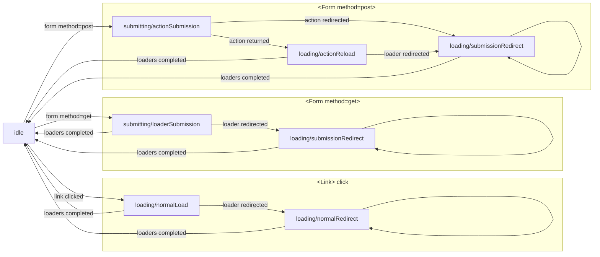

# Router

The `@remix-run/router` package is the heart of [React Router](https://github.com/remix-run/react-router) and provides all the core functionality for routing, data loading, data mutations,
and transitions.

If you're using React Router, you should never `import` anything directly from
the `@remix-run/router` or `react-router` packages, but you should have everything
you need in either `react-router-dom` or `react-router-native`. Both of those
packages re-export everything from `@remix-run/router` and `react-router`.

## API

A Router instance can be created using `createRouter`:

```js
let router = createRouter({
  // Routes array using react-router RouteObject's
  routes,
  // History instance
  history,
  // Callback function executed on every state change
  onChange: (state) => { ... },
  // Optional hydration data for SSR apps
  hydrationData?: HydrationState;
}
```

Internally, the Router represents the state in an object of the following format, which is available through `router.state` or via the `onChange` callback function:

```ts
interface RouterState {
  // The `history` action of the most recently completed navigation
  action: Action;
  // The current location of the router.  During a transition this reflects
  // the "old" location and is updated upon completion of the navigation
  location: Location;
  // The current set of route matches
  matches: RouteMatch[];
  // The state of the current transition
  transition: Transition;
  // Data from the loaders for the current matches
  loaderData: RouteData;
  // Data from the action for the current matches
  actionData: RouteData | null;
  // Exceptions thrown from loaders/actions for the current matches
  exceptions: RouteData | null;
}
```

### Navigations

All navigations are done through the `router.navigate` API which is overloaded to support different types of navigations:

```js
// Link navigation (pushes onto the history stack by default)
router.navigate('/page');

// Link navigation (replacing the history stack)
router.navigate('/page', { replace: true });

// Pop navigation (moving backward/forward in the history stack)
router.navigate(-1);

// Form navigation
router.navigate('/page', {
  formMethod: 'GET',
  formData: new FormData(...),
});
```

## Transition Flows

Each navigation (link click or form submission) in the Router is reflected via an internal `state.transition` that indicates the state of the navigation. This concept of a `transition` is a complex and heavily async bit of logic that is foundational to the Router's ability to manage data loading, submission, error handling, redirects, interruptions, and so on. Due to the user-driven nature of interruptions we don't quite believe it can be modeled as a finite state machine, however we have modeled some of the happy path flows below for clarity.


